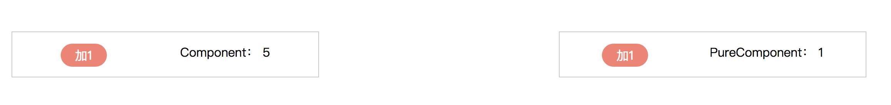

### introduction
react 渲染优化问题

#### component vs pureComponent
```
src/containers/usual/A

// AA is UsualComponent
// PureAA is PureComponent
```


点击加1，PureComponent 类型的组件没有发生变化，Component 的会持续加1。
#### immutable

#### with redux

### with mobx
